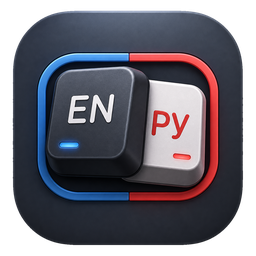

  

# LangRuEn

LangRuEn is a macOS menu bar utility for automatic RU/EN keyboard layout correction.

It watches typed words, detects when text was entered in the wrong keyboard layout, corrects it, and helps quickly switch between Russian and English input. The app is designed for Russian-speaking macOS users who often type in both layouts.

## Download

Download the latest beta DMG:

[LangRuEn-Beta.dmg](https://github.com/almaziphone/LangRuEnUpdates/releases/download/beta/LangRuEn-Beta.dmg)

## Installation

1. Open the downloaded DMG.
2. Drag `LangRuEn.app` into `Applications`.
3. Launch LangRuEn from `Applications`.
4. Grant Input Monitoring and Accessibility permissions when macOS asks.

## Features

- Automatic RU/EN layout correction.
- Menu bar indicator for the current layout.
- `Esc` cancels the last correction.
- Personal words and exclusions.
- Correction history.
- Public beta update feed.

## Update Feed

LangRuEn checks this public feed for beta updates:

[update.json](https://github.com/almaziphone/LangRuEnUpdates/releases/download/beta/update.json)

Author: [almazbek@me.com](mailto:almazbek@me.com)
